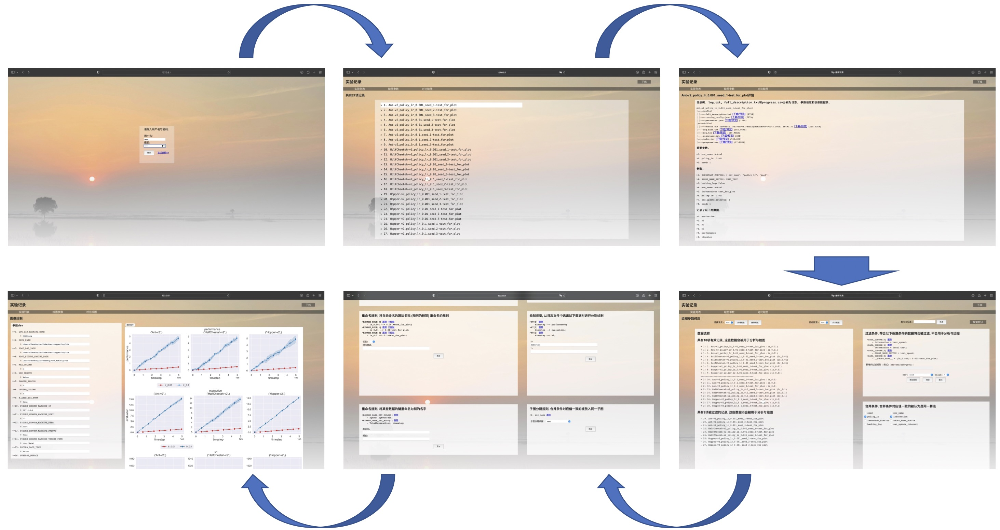

# Smart Logger Utils

## 简介
  这是一套训练日志管理的代码，用于方便训练的管理，包括以下功能
  - [x] 日志记录，可以将所有打印到屏幕的信息重定向到文件
  - [x] 数据记录，可以将需要记录下的过程数据保存到文件
  - [x] 代码备份，在程序运行前，会自动将代码打包备份
  - [x] 日志同步，提供接口将代码自动同步到远程服务器
  - [x] 参数管理，提供参数设定接口，并将所有参数都保存到文件
  - [x] 绘图，将所记录的数据绘制出来
  - [x] 定时绘制图像
  - [x] 所绘制的图像会自动同步至前端
  - [x] 前端展示实验结果
  - [x] 前端显示所有实验的参数、并提供所有文件的下载链接
  - [x] 前端可以控制如何绘制图像


## 要求
以下为软件库依赖要求
```
- tensorboardX # [ 基础 ] 我们用tensorboardX来写tensorboard
- tensorboard # [ 基础 ] tensorboardX依赖于tensorboard库
- numpy # [ 基础 ] 我们使用了numpy的基本数学运算
- paramiko # [ 基础 ] 如果需要进行代码/日志的远程同步，需要有paramiko
- matplotlib # [ 绘图 ] 我们用matplotlib进行图像绘制
- seaborn # [ 绘图 ] 我们使用了seaborn的绘图风格
- flask # [ 网页前端 ] 我们用flask搭建图形网页
- flask_cors # [ 网页前端 ] 同上
- simplejson # [ 基础 ] 我们用json保存参数配置
- Pillow # [ 绘图 ] 我们使用Pillow对绘制的图像进行整合等后处理操作
- pandas # [ 基础 ] 我们使用pandas读取和处理表格数据
```
使用为了确保`smart_logger`能够正常运行，请安装以上几个库。我们也把以上依赖写入了`requirement.txt`与`setup.py`。用以下命令可以一键安装
```bash
pip install -e .
```

## 前端展示效果
前端页面如图所示，登录之后我们就可以看到所有的实验记录，任意点击一个实验记录即可看到内部的所有数据，我们可以预览或下载任意一个文件。通过对绘图设置进行配置之后，我们可以将算法对比图绘制出来。

快速启动前端页面
```bash
python -m smart_logger.htmlpage -p 8000 -u user -pw 123456 -wks ~/Desktop/small_logger_cache
```
## 怎么用


**把`smart_logger`拷贝到你的程序中**.
## 我们需要配置什么
1. 修改`smart_logger/paramter/Parameter.py`的`parse`函数，这里面填写我们需要设置的参数。
2. 修改`smart_logger/common/experiment_config.py`，这里面包含了本次实验相关的一些配置
3. 修改`smart_logger/common/common_config.py`，这里面包含了日志配置、远程服务器的日志备份配置。
4. 修改`smart_logger/common/plot_config.py`，这里面包含了画图的配置。
5. 修改`smart_logger/common/page_config.py`，这里面包含了前端页面的配置。

## 融入到代码中
在主函数的最开始加入这几行，将我们的参数与日志系统配置完成，我们就可以用`parameter`变量去得到所有的参数，可以用`logger`变量去记录数据

```python
# 标准初始化方法
from demo_parameter.Parameter import Parameter
from smart_logger.util_logger.logger import Logger
import os

# 实例化参数, 此处解析输入为参数
parameter = Parameter()
# 实例化logger，这里，我们根据参数来调整logger的文件的保存位置
logger = Logger(log_name=parameter.short_name, log_signature=parameter.signature, logger_category=parameter.suffix)
# 设置parameter的logger
parameter.set_logger(logger)
# 设置parameter的保存路径
parameter.set_config_path(os.path.join(logger.output_dir, 'config'))
# 保存parameter
parameter.save_config()
```

### 如果你不想用参数系统
你可以只用日志系统

```python
from smart_logger.util_logger.logger import Logger

logger = Logger(log_name='simple_log', logger_category='TEST')
```
### 打印日志
```python
logger('xxxxx')
```
### 获得某参数
```python
parameter.xxxxx
```
### 记录tensorboard
```python
# tb_prefix是写tensorboard时的前缀，方便看tensorboard时进行变量的分组, 记录3个data1的数值，分别为1, 2, 3，记录了1个data2的数值
logger.add_tabular_data(tb_prefix='aaa', data1=[1, 2, 3], data2=2, date3=0.0)
# add_tabular_data可以多次调用，最后写入tensorboard并记录到文件中的是多次写入的均值
logger.add_tabular_data(tb_prefix='aaa', data1=[7, 8, 9], data2=10, date3=1.0)
# log_tabular只能被调用一次，这里记录了data4的数值，为10
logger.log_tabular(tb_prefix='bbb', key='data4', val=10)
...
# 进行数据汇总并打印结果且写入文件
logger.dump_tabular()
```

### 将代码同步到远程服务器
（远程服务器在`common/common_config.py`里配置）
```python
# 将代码发送到远程服务器
logger.sync_log_to_remote(replace=True)
```

### 配置全局logger
在最开始实例化`logger`之后，可以将Logger的logger改成实例化好的logger（但不是必要）
```python
Logger.logger = logger
```
这样在别的文件地方可以这样使用logger
```python
Logger.logger('xxxx')
Logger.logger.add_tabular_data(xxxxx)
```


### 如果你不想用日志系统
你可以只用参数系统

```python
from demo_parameter.Parameter import Parameter
import os

parameter = Parameter()
parameter.set_config_path(os.path.dirname(os.path.abspath(__file__)))
parameter.save_config()
```

## 进阶
### 图形绘制
`smart_logger`支持对训练曲线进行绘制。图像绘制分两步**绘图配置**与**运行绘图脚本**。绘图配置在`smart_logger/common/plot_config.py`中。
绘图逻辑是这样的
1. 遍历日志存放的文件夹`PLOT_LOG_PATH`，找到所有日志文件
2. 根据`DATA_IGNORE`，过滤掉一些日志文件
3. 对过滤后的日志文件，根据`DATA_MERGER`进行合并，判断每个日志属于什么算法的，然后把属于同一个算法的日志分到同一类
4. 使用`SHORT_NAME_FROM_CONFIG`对算法进行重命名，（算法的默认名字是`DATA_MERGER`列出的参数直接拼起来的，不好直接看）
5. 分别对`PLOTTING_XY`列出来的各种图进行多进程的并行绘制
   1. 新建一张图，根据`FIGURE_SEPARATION`判断子图的个数，根据`MAX_COLUMN`判断一行最多多少个子图，并根据`SUBPLOT_WSPACE`与`SUBPLOT_HSPACE`设置子图之间的间隔。
   2. 对每一个算法，把里面所有的日志进行平均，得到均值和标准差，然后如果`USE_SMOOTH`，则对曲线进行平滑。
   3. 对曲线的均值和阴影进行绘制。
   4. 绘制图例，图例位置为`LEGEND_POSITION`，图例一行最多`LEGEND_COLUMN`列。
   5. 将图片保存到`PLOT_FIGURE_SAVING_PATH`命名为`PLOTTING_XY`的Y对应的名字
6. 将`PLOTTING_XY`所对应的所有图进行汇总，拼接成一个大图，并发送到远程服务器`FIGURE_SERVER_MACHINE_*`的`FIGURE_SERVER_MACHINE_TARGET_PATH`路径下。
我们运行
```bash
python smart_logger/report/plotting.py
```
即可完成以上的流程。
因为我们的训练是持续跑的，我们要是想事实的看到结果我们可以直接用自动绘图脚本
```bash
python smart_logger/report/auto_plot.py
```
注：自动绘图脚本一般都是在`smart_logger/common/common_config.py`所列的远程服务器中运行，因为这台机器是数据中心，有最全的数据。
### 前端数据展示
我们还设计了一个前端页面，对日志数据进行展示，并绘图。配置文件在`smart_logger/common/common_config.py`中。
前端是跟绘图一起作用的，所以我们也要同时关注并修改`smart_logger/common/plot_config.py`。
相关配置配好之后，我们就能够启动前端服务。
只要运行
```bash
python smart_logger/front_page/page.py
```
前端服务就能够起来了，我们此时需要访问`http://WEB_NAME:PORT`，就可以看到前端页面所展示的东西。首先我们用设定好的用户名和密码进行登录。登录进去之后，里面包括三部分
- 实验列表，列了所有搜索到的日志，并可以直接下载这些日志的文件。
- 绘图参数，列出了几个重要的绘图参数，用于对日志文件过滤，对算法命名。
- 对比绘图，列出了几个绘图相关参数，并提供了一个绘图的按钮进行图像绘制。

## 示例代码
我们在`tutorial`中准备了三个示例代码分别为
- `basic_log_demo.py`，用于基本的日志功能的示范
- `plotting_demo.py`，绘图的基本展示
- `html_demo.py`，网页展示的示例，运行之后登录"http://0.0.0.0:7005"即可访问
三个示例均是直接运行
```bash
python tutorial/xxx.py
```
但注意
- `plotting_demo.py`绘制图像之后，图像会存在`/path/to/SmartLogger/logfile/figure`下。
- `html_demo.py`需要配置网页缓存文件的存放位置，这里需要进行修改，不然可能会报错。运行好之后，登录"http://0.0.0.0:7005"访问，其中用户名密码在`common/page_config.py`中可以找到。
- 以上两个`py`文件都需要调用`generate_data.py`的接口生成一些模拟的日志文件，这可能需要几十秒。

## 如果只想用前端实验数据展示功能
同样可以用`tutorial/htmlpage.py`来直接启动一个服务，注意，需要将`DATA_PATH`与`WORKSPAPCE`这两个参数进行合理的设置，这里需要再次强调一下
- DATA_PATH: 数据目录，该目录下存有日志文件，程序会自动在这个目录下进行对数据进行自动的搜索。
- WORKSPACE：本地工作目录，该目录会自动创建，并会在里面写入一些缓存文件，如缓存的配置信息，绘制的曲线图，可以把这个目录设置到一些无关紧要的地方。

### 数据格式
每一个实验的数据都要存放在一个文件夹中，当然不同的实验可以不在同一级目录，我们是通过实验数据来定位实验日志的位置的。因此我们约定每个实验都需要有以下两个文件
- `progress.csv`，是一个csv的表格文件，需要保证我们如果使用`pandas`去读取这个文件不会报错，即下面的命令可以正常运行。
```python
import pandas as pd
pd.read_csv('progress.csv')
```
这是日志文件中最重要的文件，程序会通过搜索`progress.csv`来定位日志的位置。
这个表格的每一列都是一个训练过程的指标，列首标明了它的名称，之后的每一行代表了算法每一次迭代打印的数据。
- `parameter.json`，是一个json文件，它表示的是字典，并且我们需要确保我们可以通过以下命令来读取`parameter.json`
```python
import json
config = json.load(open('parameter.json', 'r'))
```
`parameter.json`需要保存到与`progress.csv`同级的位置，或者在`progress.csv`所在的文件夹的一个名为`config`的子文件夹中。
`parameter.json`储存的是算法运行的配置，我们对其中储存的东西没有硬性要求，只要他表示的是字典即可。
我们建议（没有的话程序也能运行）一个`parameter.json`中包含以下的东西
1. `env_name`，实验的任务/环境名字
2. `seed`，随机种子设置
3. `information`，实验运行时的一些额外信息，可以是实验的目的等信息

