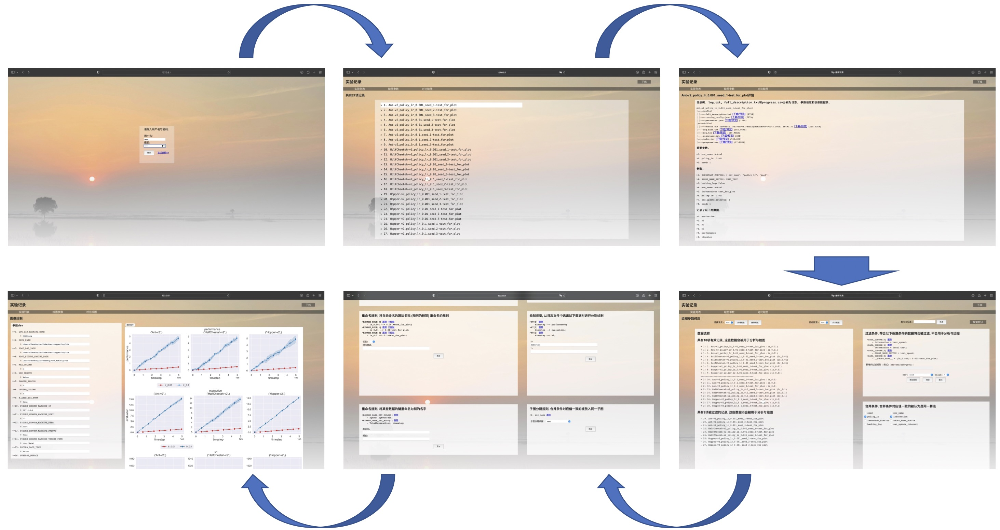

# Smart Logger Utilities

## 简介

  这是一套训练日志管理的代码，用于方便训练的管理，包括以下功能
  - [x] 日志记录，可以将所有打印到屏幕的信息重定向到文件
  - [x] 数据记录，可以将需要记录下的过程数据保存到文件
  - [x] 代码备份，在程序运行前，会自动将代码打包备份
  - [x] 日志同步，提供接口将代码自动同步到远程服务器
  - [x] 参数管理，提供参数设定接口，并将所有参数都保存到文件
  - [x] 绘图，将所记录的数据绘制出来
  - [x] 定时绘制图像
  - [x] 所绘制的图像会自动同步至前端
  - [x] 前端展示实验结果
  - [x] 前端显示所有实验的参数、并提供所有文件的下载链接
  - [x] 前端可以控制如何绘制图像


## 要求
以下为软件库依赖要求
```
- tensorboardX # [ 基础 ] 我们用tensorboardX来写tensorboard
- tensorboard # [ 基础 ] tensorboardX依赖于tensorboard库
- numpy # [ 基础 ] 我们使用了numpy的基本数学运算
- paramiko # [ 基础 ] 如果需要进行代码/日志的远程同步，需要有paramiko
- matplotlib # [ 绘图 ] 我们用matplotlib进行图像绘制
- seaborn # [ 绘图 ] 我们使用了seaborn的绘图风格
- flask # [ 网页前端 ] 我们用flask搭建图形网页
- flask_cors # [ 网页前端 ] 同上
- simplejson # [ 基础 ] 我们用json保存参数配置
- Pillow # [ 绘图 ] 我们使用Pillow对绘制的图像进行整合等后处理操作
- pandas # [ 基础 ] 我们使用pandas读取和处理表格数据
```
使用为了确保`smart_logger`能够正常运行，请安装以上几个库。我们也把以上依赖写入了`requirement.txt`与`setup.py`。用以下命令可以一键安装
```bash
pip install -e .
```

## 前端展示效果
前端页面如图所示，登录之后我们就可以看到所有的实验记录，任意点击一个实验记录即可看到内部的所有数据，我们可以预览或下载任意一个文件。通过对绘图设置进行配置之后，我们可以将算法对比图绘制出来。

快速启动前端页面
```bash
python -m smart_logger.htmlpage -p 8000 -u user -pw 123456 -wks ~/Desktop/small_logger_cache
```
## 怎么用

请见[详细教程](tutorial.md)。
